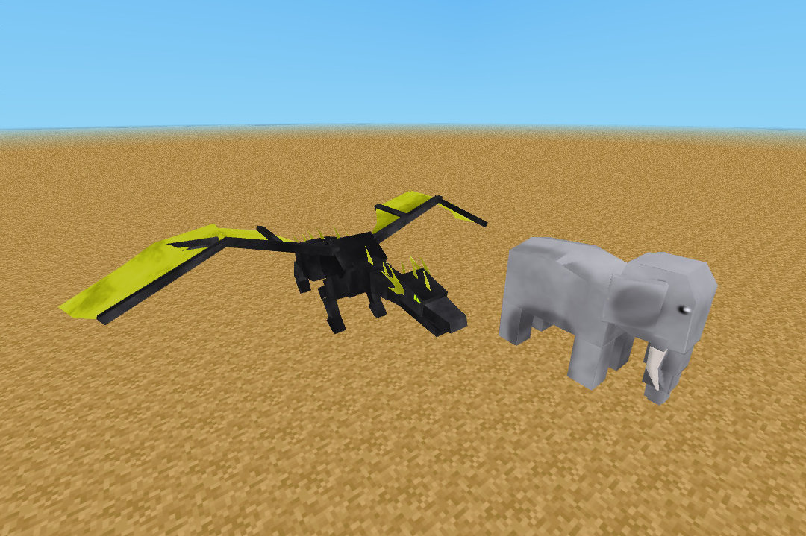

minetest mod mobs D00Med
=========================

This mod add dragons, pandas, fox, owl, and many more animals that can be loved or enemies!

Information
-----------

Some of those mobs are already in others mods.. like Dragon (nether), wasp (nssm/mobs_monster)

Dragon gems are dropped by the "boss" dragons ie: the wyvern, the water dragon, and the great dragon(red+black).

If you see a wasp, bee careful because it wasp probably spawned by the "king of sting", a huge wasp that will make nests and spawn more wasps. Golems sometimes drop their heads. you can use these to make a friendly golem, if you place one on top of two stone blocks. Foxes are sneaky, they will dig through fences if you try to trap them.

You must first place an egg in a "nest" made of lava, obsidian, cactus, or ice.
Then you can right click the egg with a gem(the purple one), and after a while the egg will change color. Then you have to right click it with the gem that matches the type of dragon in the egg.

* Red dragon - Lava nest - Fire gem
* Green dragon - Cactus nest - Poison gem
* Blue dragon - Ice nest - Ice gem
* Black dragon - Obsidian nest - Lightning gem

The nests are just the nodes above, surrounding the egg on all sides and underneath.

To get tame dragons you need to hatch them from eggs.

Technical info
--------------

This mod is named `dmobs`, will added 16 new mobs, and if enabled dragons plus 4 more, will also  add 10 megs of more media to your server game to be downloaded by clients..

Please for more technical info about dragons read the [dragons.md](dragons.md) file.

There's an api for vehicles and mount, it forked little lib_mount lua api so can be outdated in future.

Models sources are in [projects](projects) directory of course in GIMP format.

### Depends

* default
* mobs
* wool
* farming
* bones
* mobs_animal (optional)
* ethereal (optional)
* caverealms (optional)

### Download

This is a fork from official repository, that integrates the taikedz and mckaygerhard little fixeds, is the official continuation as explained by taikedz at https://github.com/minetest-mobs-mods/dmobs/commit/176b60d756bd5c6a1b6bff7234e894c0bc2463ac thanks to tenplus1 work

It also try to be compatible with both 0.4 and 5+ engines of minetest and can be downloaded from ContenDB or using git from this repository

### Configurations

| Configuration variable  | Description                    | type  | default |
| ----------------------- | ------------------------------ | ----- | ----- |
| dmobs.regulars          | Enable most common new animals | bool  | true  |
| dmobs.eggtimer          | Timer for the egg mechanics    | int   | 100   |
| dmobs.destructive       | Fire balls will be destructive | bool  | true  |
| dmobs.dragons           | If disabled only a common dragon will be spawned | bool | true |
| dmobs.allow_nyanc       | Enable the stupid NyanCat mob fliying pig | bool | false |

### mobs nodes and names

Whit more chance, more rare.

There's some settings, if `dmobs.regulars` are enabled then those monster will be available:

| tech name      | type  | chance  | notes      | spawn nodes                 |
| -------------- | ----- | ------- | ---------- | --------------------------- |
| dmobs:nyan     | mobs  | 300     | friendly   | air or ethereal:mushroom/nyanland:meseleaves |
| dmobs:hedgehog | mobs  | 8000    | friendly   | group:flora, ethereal:prairie_dirt |
| dmobs:whale    | mobs  | 16000   | friendly   | default:water_source        |
| dmobs:owl      | mobs  | 16000   | friendly   | group:tree                  |
| dmobs:gnorm    | mobs  | 16000   | friendly   | default:dirt_with_grass, ethereal:bamboo_dirt  |
| dmobs:tortoise | mobs  | 8000    | friendly   | default:water_source, group:sand |
| dmobs:elephan  | mobs  | 16000   | friendly   | default:dirt_with_dry_grass, ethereal:grove_dirt |
| dmobs:pig      | mobs  | 32000   | friendly   | default:dirt_with_grass, ethereal:prairie_dirt, nyanland:cloudstone |
| dmobs:panda    | mobs  | 32000   | friendly   | default:dirt_with_grass, ethereal:bamboo_dirt |
| dmobs:waps     | mobs  | 16000   | baddly     | air/leaves  or dmobs:hive   |
| dmobs:waps_leader | mobs | 64000 | baddly     | air/leaves  or dmobs:hive   |
| dmobs:golem    | mobs  | 16000   | baddly     | group:stone                 |
| dmobs:pig_evil | mobs  | 64000   | baddly     | group:leave, ethereal:bamboo_leaves   |
| dmobs:fox      | mobs  | 32000   | baddly     | group:leaves                |
| dmobs:rat      | mobs  | 32000   | baddly     | group:stone, group:sand     |
| dmobs:treeman  | mobs  | 16000   | baddly     | group:leaves                |
| dmobs:skeleton | mobs  | 16000   | baddly     | group:stone, caverealms:stone_with_salt, default:desert_sand |

There's some settings, if `dmobs.dragon`, orcs and ogres spawn more often when dragons are disabled:

| tech name      | type  | chance  | notes      | spawn nodes                 |
| -------------- | ----- | ------- | ---------- | --------------------------- |
| dmobs:orc      | mobs  | 8000/2000 | baddly     | default:snow_block, default:permafrost_with_moss, default:permafrost_with_stone, ethereal:cold_dirt |
| dmobs:ogre     | mobs  | 16000/32000 | baddly     | default:snow_block, default:permafrost_with_moss, default:permafrost_with_stone, ethereal:cold_dirt |
| dmobs:dragon_great_tame | npc | 30000 | very rare, fire/lava | ethereal:jungle_dirt,default:jungleleaves,default:lava_source,caverealms:glow_mese, caverealms:glow_amethyst,caverealms:glow_crystal,caverealms:glow_emerald,cavereals:glow_ruby
| dmobs:dragon   | mobs  | 16000  | always enabled     | group:leaves           |
| dmobs:waterdragon | mobs  | 24000 | rare, ice/water  | default:water_source |
| dmobs:dragon1 | mobs  | 24000  | rare, fire | ethereal:fiery_dirt, default:desert_sand |
| dmobs:dragon2 | mobs  | 24000  | rare, thunder/fire | ethereal:cristal_dirt, default:dirt_with_dry_grass |
| dmobs:dragon3 | mobs  | 30000  | rare, poison | ethereal:jungle_dirt, default:jungleleaves |
| dmobs:dragon4 | mobs  | 24000  | rare, ice/water | default:snow_block, default:permafrost_with_moss, default:permafrost_with_stone, ethereal:cold_dirt |
| dmobs:wyvern  | mobs  | 32000  | rare, dog attack | group:leaves |
| dmobs:dragon_great | mobs  | 30000 | very rare, fire/lava | ethereal:jungle_dirt,default:jungleleaves,default:lava_source,caverealms:glow_mese, caverealms:glow_amethyst,caverealms:glow_crystal,caverealms:glow_emerald,cavereals:glow_ruby |

## Authors & License

Thanks to D00Med, TenPlus1, blert2112, Grossam and taikedz

See [license.txt](license.txt)
