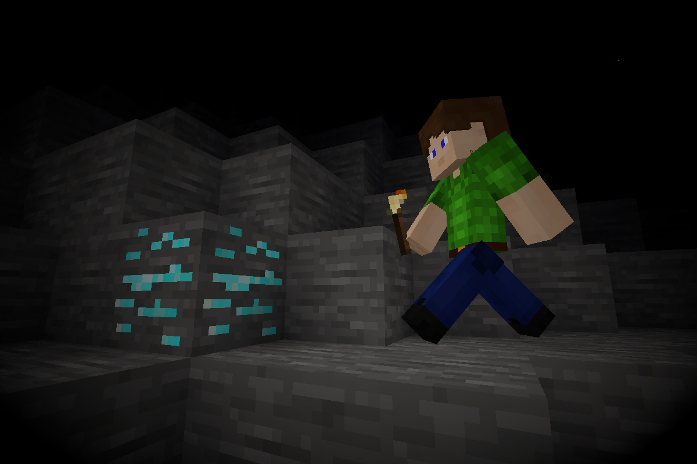

# Illumination [illumination]

Makes players emit light while holding any luminescent item. The amount of light emitted equals the brightness of the item. Luminescent armor is also supported when [`3d_armor`](https://github.com/minetest-mods/3d_armor) is installed.

Rewritten and improved fork of https://notabug.org/Piezo_/minetest-illumination.

