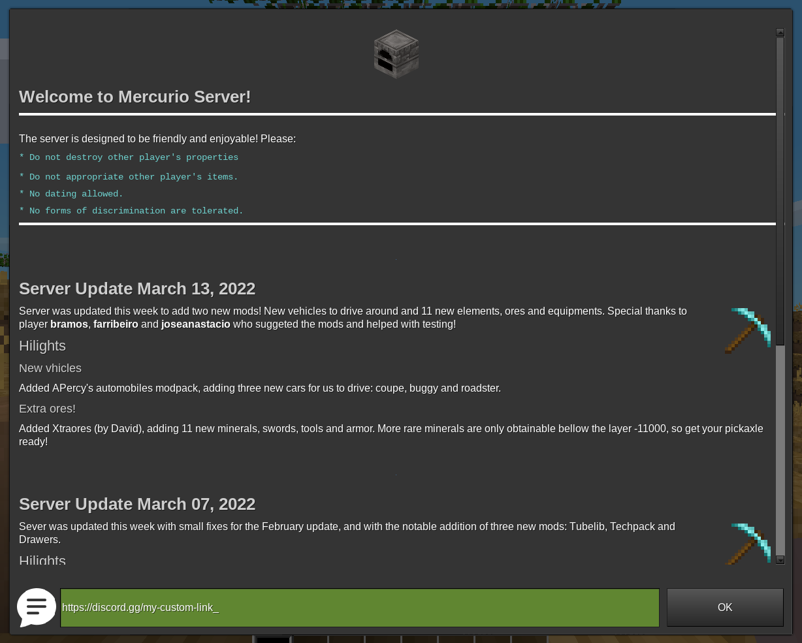
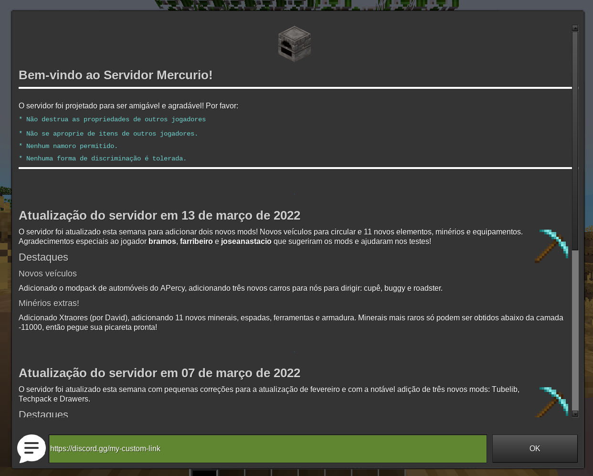

# minenews

Localized and simple server news for Minetest servers. Original version by Shara
RedCat, forked and improved by Ronoaldo.

This mod displays a formspec when the player joins. To set the news text to
display, make a file named news_*lang_code*.md in your world directory for each
locale you plan to support. The mod will fallback to a news.md file if no
localized version is found.

The contents of this file will be displayed to the player, interpreted as
Markdown. When changing the contents of the file, there is no need to restart
the server for it to update in game so you can also test quickly the display.

Players can also type `/news` to display the formspec at any time.

Players with the `news_bypass` privilege will not see the formspec when they
sign in, but can still use the `/news` command.

## Screenshots

Sample news dialog in English:

And a translated news file shown for the user if the language is set to `pt_BR`:

# License

Code for this mod is released under MIT (https://opensource.org/licenses/MIT).

This mod uses textures from Bootstrap Icons, also licensed under MIT
(https://opensource.org/licenses/MIT).