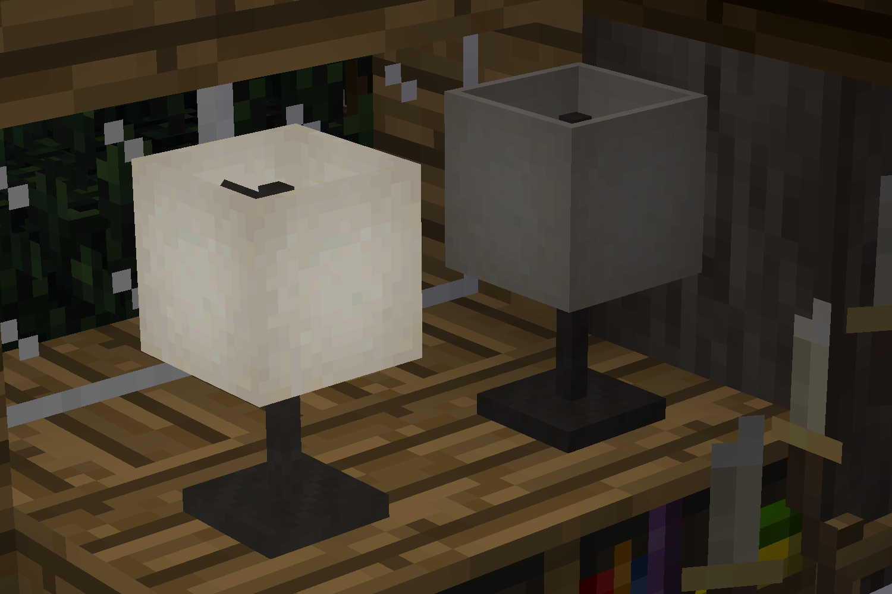

<!--
SPDX-FileCopyrightText: 2021 David Hurka <doxydoxy@mailbox.org>

SPDX-License-Identifier: CC0-1.0 OR MIT
-->

# morelights_dim

`morelights` ([GitHub](https://github.com/random-geek/morelights), [ContentDB](https://content.minetest.net/packages/random_geek/morelights/)) has several very nice lighting nodes.
This add-on mod allows to turn all light nodes from `morelights` off or to dim them.

## About

`morelights` already provides sensible light level variations for the light nodes.
But there is no way to get two lights of the same design with different light level.
This mod adds a dim variant and an off variant to every design.

Light levels can be changed by right-clicking light nodes with the bulb item from `morelights` (default configuration).

### Examples

`morelights_dim` gives you more flexibility to build different lighting sceneries.

You can emphasize a certain area by just dimming the other lights:

The dimmed and off nodes use darkened textures (in addition to emitting less light), so you can imitate broken neon tubes:

You can turn the lights off when going to bed:

If you turn the oil lamp from `morelights_vintage` off, the animated flame is hidden:

### API

The functionality of dimming light nodes, and cycling through them on right-click, is exposed in [morelights_dim/api.lua](morelights_dim/api.lua).
In short, you first register the textures which shall be darkened on dimmed nodes with `morelights_dim.register_texture_for_dimming`, and then call `morelights_dim.register_dim_variants` with a node name.
With `morelights_dim.register_light_level_tool`, you can register additional tools which can be used with right-click to change the light level. (These tools are global, not per node.)

If you want to make further modifications to the node definitions, you can use `morelights_dim.make_dim_variants`, which returns the node definitions which would be registered by `morelights_dim.register_dim_variants` otherwise.
You can do that, for example, to make more additional variants than dim and off.

The registered nodes have a field `_morelights_dim_next_variant`, which holds the name of the node which you get on right-click.
This field is used by the `on_rightclick` handler, which means you can add more variants, or change the node names, by changing this field.
The dim and off variant will be registered `:<original_mod>:<original_node>_morelights_dim_dimmed` and `:<original_mod>:<original_node>_morelights_dim_off`.

This mod is organized as modpack, with the mod `morelights_dim` providing the functionality and API.
The mods `morelights_dim_morelights_extras`, `morelights_dim_morelights_modern`, and `morelights_dim_morelights_vintage` depend on `morelights_dim` and the respective `morelights_...` mod, and call the API for the respective light nodes.

### History

The functionality of this mod was requested by myself while playing on the LinuxForks server, because light bleeded too much through my houses’ walls and ceilings.
First, I submitted a pull request to the original `morelights`.
That pull request used crafting recipes to get dimmed variants, which added too much complexity to the intentionally lightweight `morelights`.
The maintainer of `morelights` suggested to use right-click instead of crafting recipes, and to provide the functionality in a fork instead.
I liked the right-click idea, decided to make this add-on mod, and provide off variants too.

## Installation

This mod is intended to be installed from Minetest’s own content manager, [ContentDB](https://content.minetest.net/doxygen_spammer/morelights_dim).

You can also clone the repository to your `mods` folder.
You will need to disable the “LICENSES” and “screenshots” mods, if your Minetest can not figure out that these aren’t mods.

## License

The mod is licensed as CC0-1.0 and MIT.
(This means that this modpack may be merged to `morelights` at will.
I am perfectly fine with that.)

Screenshots depict artwork from other Minetest mods, and are licensed as CC-BY-SA-4.0.

## Contributing

The source code is hosted at <https://invent.kde.org/davidhurka/doxy_morelights_dim>.
Problems should be reported at <https://invent.kde.org/davidhurka/doxy_morelights_dim/issues>.
