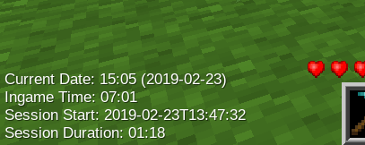
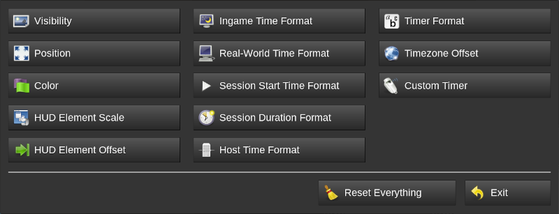
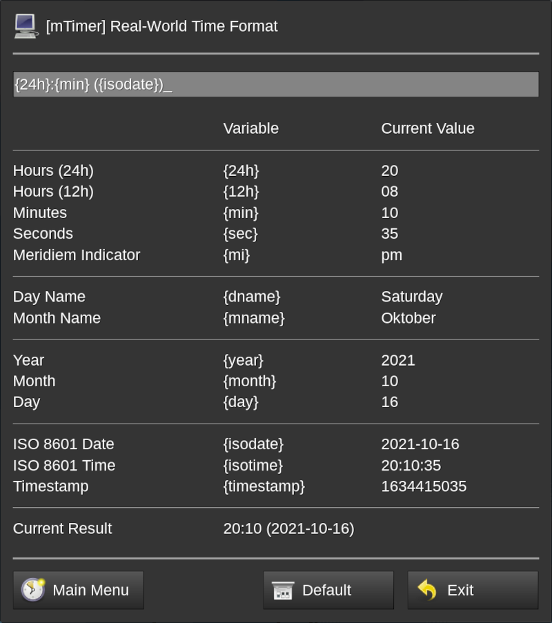
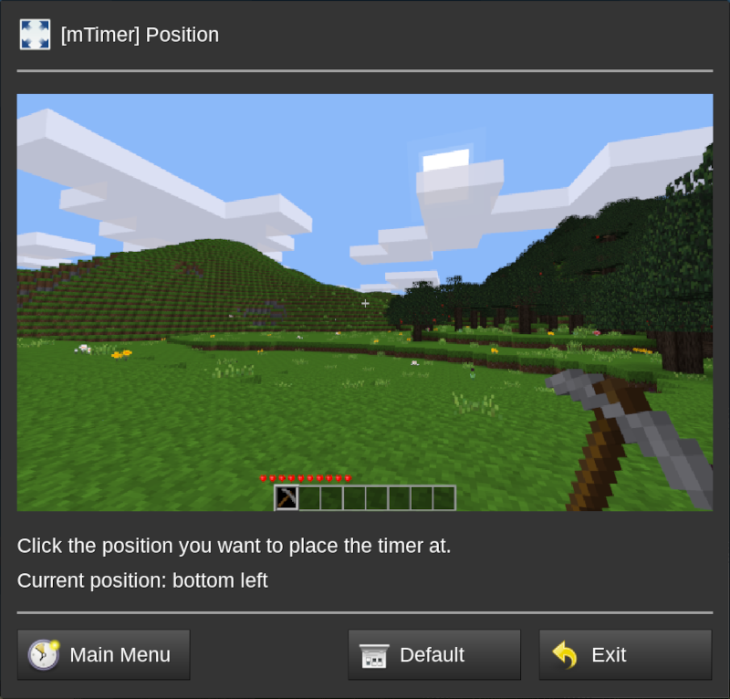
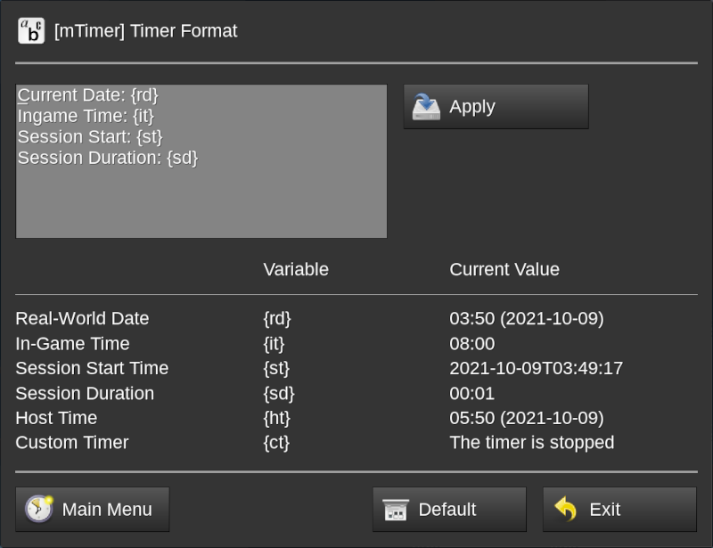
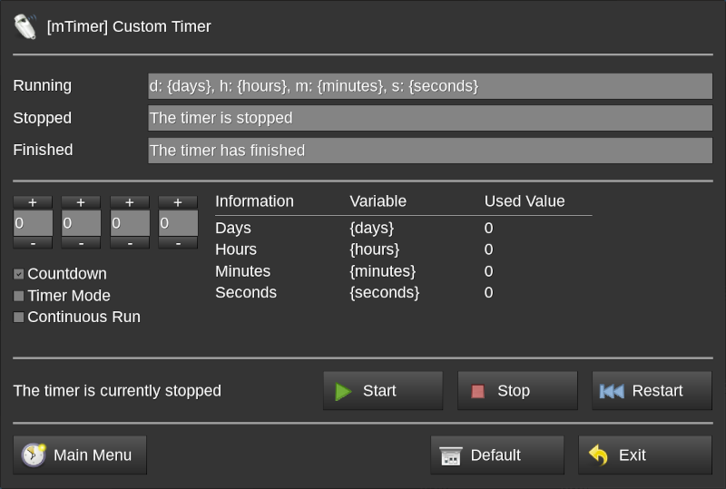

**_mTimer_ is a mod for showing ingame and reallife times and periods**

## Description

*mTimer* is a mod that allows players to individually configure and show a timer as permanent HUD element that automatically updates every second. The timer can show the real-world time and the ingame time as well as the current play session starting time and duration in freely configurable formats.



Use it on your public server to give your players additional value (players can individually hide the timer if they want) while being on your server or use it in your singleplayer world to stay informed or – when creating creative content for others to watch – give your viewers a hint on when the footage was recorded.

The mod is game-agnostic and does not have any dependencies. The mod only interfaces with Luanti’s *HUD API*, the *player meta data API* and the *Formspec API*.

## Configuration

The timer display and settings are entirely configured on a per-player basis via configuration dialogs. Configurations are set when leaving the dialog via the buttons or when pressing enter or clicking the apply button (where available). Pressing the escape key cancels the changes.

For opening the main menu simply enter the `/mtimer` chat command. From the main menu all configuration dialogs are accessible.



Simply click the button of the option you want to configure.

Configuration dialogs can be accessed directly by providing the respective parameter to the `/mtimer` chat command. Run `/mtimer help` to see a list of available parameters. You might need to bring up the console (F10 by default) to see all available parameters because the chat display might be too small.

### Variables

Some dialogs allow you to use variables. The variables and their current (i.e. the moment when opening the dialog) values are shown below the input field.



Simply use the variables as shown. For example, to use the day name in the dialog shown above simply enter `{dname}`. Using unknown variables is possible. Those variables are rendered literally. So Entering `{foobar}` renders to “{foobar}” in the output.

Using a string being a variable is not possible (`{foobar}` will always render to it’s value if it is a valid variable) but using the same variable multiple times is possible.

### Confirmations

Pressing enter in an input field applies the changes. Not all dialogs have input fields. Sometimes there only schemes or just buttons.

Using those dialogs is the same except setting things works instantly. So by clicking the bottom right on the scheme in the dialog below directly places the timer there.



Where needed, apply buttons are placed. So instead of having to leave the dialog via the navigation buttons at the bottom to apply the changes simply click the apply button to have the value applied.



In the timer format configuration dialog shown above a text area is used where pressing enter goes to a new line so a button for applying the changes is shown.

## Custom Timer

mTimer comes with a freely configurable custom timer that can run in three different modes and shows its current state and time as applicable. The formats for the three states can be configured individually.

The four time input fields on the middle left are used for days, hours, minutes, and seconds and the table with the variables shows the set value and not the current value because the current value changes depending on the timer state and mode.



In *Countdown* mode the custom timer counts down from the time that was set using the time input fields. In *Timer* mode the custom timer counts up to the value that was set. And in *Continuous Run* mode the custom timer counts up from when it was started, adding the time that was set to the starting point calculation.

After the custom timer was set up it needs to be started. Starting (as well as stopping or restarting) it is done using the defined chat commands.

```
/mtimer ctstart    -- Start the timer if not running
/mtimer ctstop     -- Stop the timer if running
/mtimer ctrestart  -- Restart the timer if running
```

If the custom timer finished the format changes to the “finished” value. Please note that the timer is still running if this message is shown. To stop the timer you need to invoke the corresponding chat command. Only if the “stopped” format is used the timer is actually stopped (i.e. most of it’s logic isn’t running).

## Default configuration (interesting for server admins)

The default configuration is loaded on server start and applied when a new player joins or an already existing player sets any (or all) of the mTimer values to the default value via the main menu or one of the specific dialog formspecs.

The mod tries to load the configuration from least to most mod specific locations:

1. Default configuration that is used to load the server
2. From `_mtimer.conf` in the served world’s directory
3. Built-in default setting defined by the mod’s author

There is intentionally no `settingtypes.txt` because the mod is meant to be configured by the individual players. The following options can be set in either `1.` or `2.` without changing the mod’s code. After that a server restart is necessary.

```ini
mtimer_color = #ffffff
mtimer_hud_element_scale = 1
mtimer_position = bl
mtimer_timezone_offset = 0
mtimer_visible = true

mtimer_hud_element_offset_x = 0
mtimer_hud_element_offset_y = 0

mtimer_host_time_format = {24h}:{min} ({isodate})
mtimer_ingame_time_format = {24h}:{min}
mtimer_real_time_format = {24h}:{min} ({isodate})
mtimer_session_duration_format = {hours}:{minutes}
mtimer_session_start_time_format = {isodate}T{isotime}
mtimer_timer_format = S('Current Date: @1', '{rd}'){_n}S('Ingame Time: @1', '{it}'){_n}S('Session Start: @1', '{st}'){_n}S('Session Duration: @1', '{sd}')

mtimer_custom_timer_running_format = d: {days}, h: {hours}, m: {minutes}, s: {seconds}
mtimer_custom_timer_stopped_format = S('The timer is stopped')
mtimer_custom_timer_finished_format = S('The timer has finished')

mtimer_custom_timer_value_days = 0
mtimer_custom_timer_value_hours = 0
mtimer_custom_timer_value_minutes = 0
mtimer_custom_timer_value_seconds = 0

mtimer_custom_timer_mode = countdown
```

The `mtimer_timer_format` value allows a special replacement variable. All occurrences of a literal `{_n}` will be replaced with a newline. This is done because configuration values cannot have a newline. All `S()` values are translated. Unfortunately currently you cannot set translatable string in configuration options.

## Known issues

### Formspecs look weird

On very small screens the configuration dialogs might look very crammed with text being cut off or overlaying other text. This is due to how formspecs work and is not fixable without massive Luanti engine changes.

Same in the other direction: On very large screens the dialogs seem unnecessary huge with much empty space. Same here: This is not fixable without re-implementing formspec generation from scratch in Luanti.

mTimer was tested with resolutions from 1024×768 up to 2560×1440 with 20px font and GUI scaling of 1.5. Since different font sizes and GUI scaling are somewhat broken in Luanti when it comes to formspecs the later was usable but did not look that good.

### Dialog language does not match dame language

Simple: The mod was not translated to the language you’re using. Feel free to translate it and file a pull request. I’d be happy to merge it.

Currently German (`language = de`) and Italian (`language = it`) are supported as translation language and English being the default and Italian being slightly out of date.

### HUD element scale slider does not reset

The slider dialog is created using a formspec scroll bar element. For some reason it seems not to be possible to properly reload the formspec programmatically so the actual value is used.

Currently there is nothing that can be done in order to instantly reset the formspec as needed to reflect the state of the dialog after the value was reset to default. The HUD element itself is reset and when re-opening the HUD element scale dialog the correct value is shown again.

### When unchecking the custom timer type nothing is enabled

This is a visual glitch. The timer operates in the last selected mode. The checkmark re-appears when closing and re-opening the custom timer dialog.

## Translations

Missing your language? Feel free to add it!

[](https://translate.codeberg.org/projects/linuxdirks-luanti-mods/mtimer)
