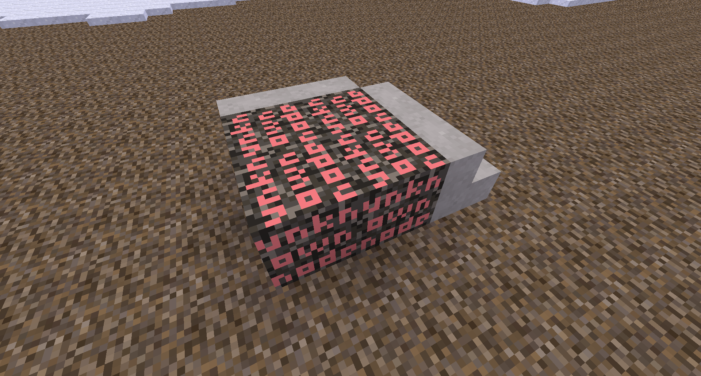

placeholder node / a better unknown node


[](license.txt)
[](https://content.minetest.net/packages/BuckarooBanzay/placeholder)
[](https://coveralls.io/github/BuckarooBanzay/placeholder?branch=master)

# Overview



Provides a "better" unknown node which can be handled properly by worldedit and other schematic mechanisms (given they support metadata).

Features:
* Handles and restores metadata
* Restores the original node and metadata if it is available (via lbm)
* Can be serialized and deserialized with worldedit

Use-cases:
* Schematic handling with unknown nodes

# How it works

There is a placeholder node (`placeholder:placeholder`) which holds all the relevant data about the unknown node in its metadata:
* `original_nodename` the original nodename
* `original_metadata` the original metadata, serialized with `minetest.serialize`
* `original_param2` (optional) the original param2

# Api

```lua
local pos = { x=0, y=0, z=0 }
local metadata = {
    inventory = {},
    fields = {
        x = "y"
    }
}
-- place a placeholder manually
placeholder.place(pos, {name="unknown:nodename"}, metadata)

-- create just the in-memory representation of a placeholder (for later placement)
local placeholder_node, placeholder_metadata = placeholder.create(node, metadata)
placeholder_node = {
    name = "placeholder:placeholder"
}
placeholder_metadata = {
    inventory = {},
    fields = {
        ["infotext"] = "Unknown node: 'unknown_nodename'",
        ["original_metadata"] = ...
    }
}

-- unwrap the placeholder metadata (returns the original node- and metadata, useful for schematics)
local meta = minetest.get_meta(pos)
local node, metadata = placeholder.unwrap(meta)

-- try to restore the placeholder at the position
-- this function gets also called in the placeholder-lbm for automatic restoration
placeholder.replace(pos)
```

# License

* Code: MIT
