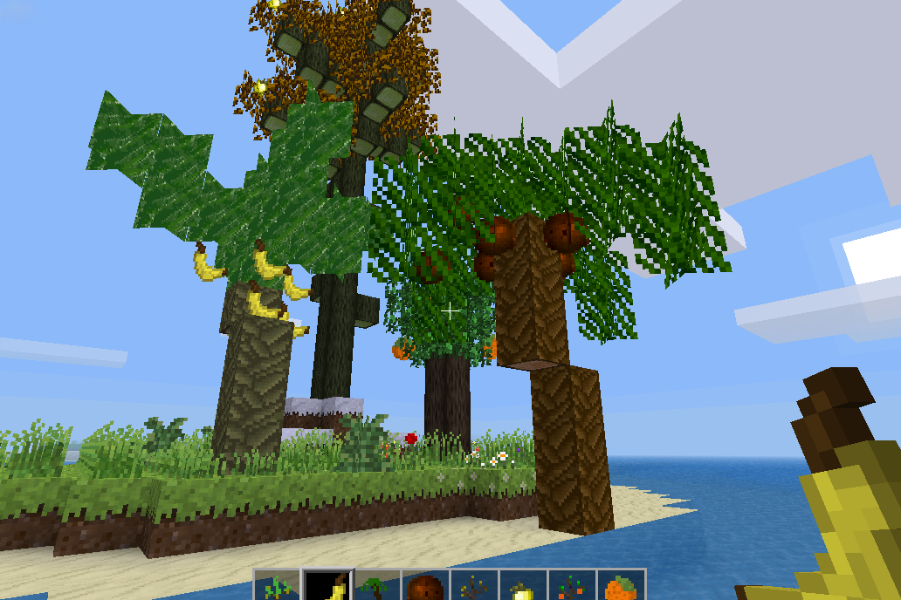

Regrowing Fruits
===

Info
----

This mod causes fruits on trees from various other mods to regrow like apples in the 5.0 release of Minetest Game.
If you placed the fruits by hand or removed the tree leaves, the fruits don't regrow.

Cool_trees modpack, ethereal, farming_plus, multibiomegen, australia, aotearoa and moretrees are currently supported.
Default apples in older versions than Minetest 5.0 will also regrow.

Ideas, bug reports or requests for more mod support are always welcome in the [Minetest Forum topic](https://forum.minetest.net/viewtopic.php?f=9&t=24986) or via the [Git Issue Tracker](https://git.sp-codes.de/minetest/regrowing_fruits/issues)!

Credits
----

This mod is inspired by "endless_apples" by Shara RedCat (2018).

License
----

Code for this mod is released under [MIT](https://spdx.org/licenses/MIT.html) (see [LICENSE](LICENSE)).
